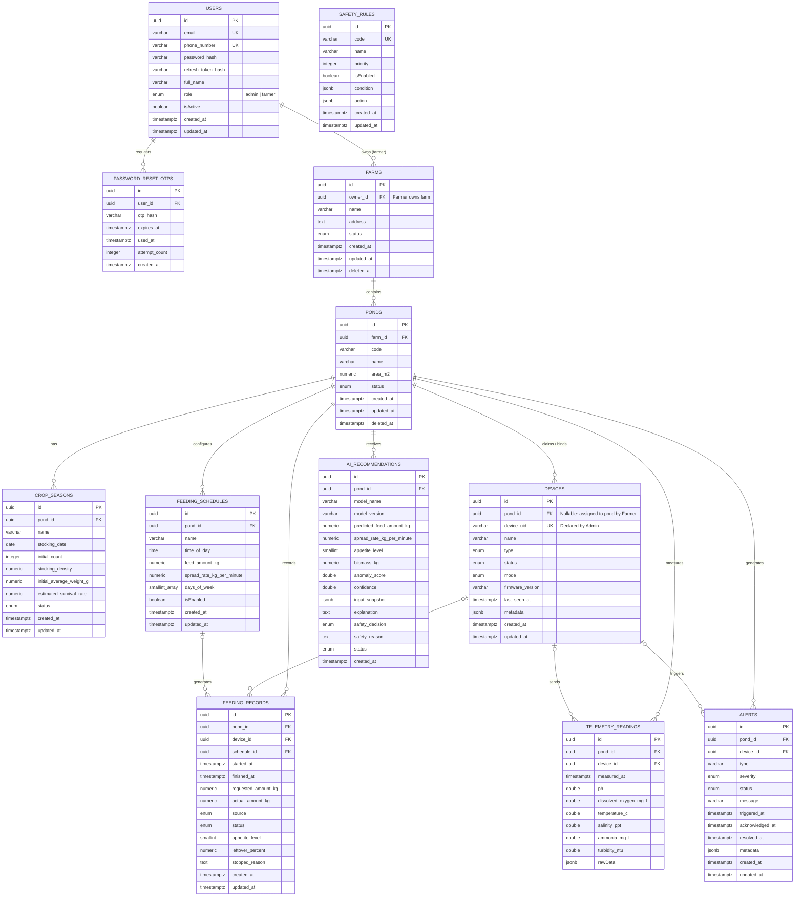

# ShrimpMate Database Schema

Tài liệu mô tả kiến trúc cơ sở dữ liệu hiện tại dựa trên các entity, migration và mô hình phân quyền **2 Roles** (`admin` & `farmer`) của hệ thống ShrimpMate.

---

## 1. Danh sách bảng

- `users`: Tài khoản người dùng (Admin & Farmer)
- `farms`: Trang trại nuôi tôm (gắn với Farmer sở hữu qua `owner_id`)
- `ponds`: Ao nuôi tôm (thuộc Farm)
- `crop_seasons`: Vụ nuôi của từng ao
- `devices`: Danh mục thiết bị phần cứng IoT chuẩn & thiết bị đã gán ao
- `feeding_schedules`: Lịch cho ăn tự động của ao
- `feeding_records`: Nhật ký các lần cho ăn
- `telemetry_readings`: Dữ liệu đo đạc chỉ số môi trường nước (pH, DO, nhiệt độ, độ mặn, NH₃, độ đục)
- `ai_recommendations`: Đề xuất lượng thức ăn, cường độ bắt mồi (FIS) và quyết định an toàn từ AI
- `safety_rules`: Luật an toàn môi trường nước
- `alerts`: Cảnh báo nguy hiểm / sự cố thiết bị
- `password_reset_otps`: Mã OTP khôi phục mật khẩu

*(Bảng `user_pond_assignments` là bảng trung gian cũ từ mô hình 3 roles, hiện đã được thay thế bằng quan hệ trực tiếp `users` -> `farms` -> `ponds`)*.

---

## 2. Chi tiết bảng

### `users`

Lưu tài khoản đăng nhập hệ thống.

| Cột | Kiểu | Ràng buộc / Mô tả |
|---|---|---|
| `id` | UUID | PK |
| `email` | VARCHAR(255) | Unique, bắt buộc |
| `phone_number` | VARCHAR(20) | Unique, số điện thoại Việt Nam |
| `password_hash` | VARCHAR(255) | Mật khẩu đã mã hóa (bcrypt) |
| `refresh_token_hash` | VARCHAR(255) | Có thể rỗng, hash refresh token hiện tại |
| `full_name` | VARCHAR(150) | Họ và tên |
| `role` | ENUM | `admin`, `farmer` (mặc định: `farmer`) |
| `isActive` | BOOLEAN | Mặc định `true` (Admin có thể khóa/mở khóa) |
| `created_at` | TIMESTAMPTZ | Thời gian tạo |
| `updated_at` | TIMESTAMPTZ | Thời gian cập nhật |

**Mô hình phân quyền:**
- `admin`: Quản trị viên nền tảng, duy trì máy chủ, quản lý danh mục phần cứng IoT chuẩn, kiểm soát trạng thái tài khoản và theo dõi báo cáo toàn hệ thống.
- `farmer`: Người nuôi tự chủ toàn quyền cơ sở nuôi của mình, sở hữu trang trại qua `farms.owner_id`. Toàn bộ ao nuôi (`ponds`) thuộc Farm mặc nhiên thuộc quyền sở hữu độc quyền của Farmer đó.

---

### `farms`

Lưu thông tin trang trại nuôi tôm.

| Cột | Kiểu | Ràng buộc / Mô tả |
|---|---|---|
| `id` | UUID | PK |
| `owner_id` | UUID | FK -> `users.id`, ID của Farmer sở hữu trang trại |
| `name` | VARCHAR(150) | Tên trang trại, bắt buộc |
| `address` | TEXT | Địa chỉ, có thể rỗng |
| `status` | ENUM | `active`, `inactive` |
| `created_at` | TIMESTAMPTZ | Thời gian tạo |
| `updated_at` | TIMESTAMPTZ | Thời gian cập nhật |
| `deleted_at` | TIMESTAMPTZ | Dùng cho soft delete |

Index: `IDX_farms_owner_id` trên `owner_id`.

---

### `ponds`

Lưu thông tin ao nuôi thuộc từng trang trại.

| Cột | Kiểu | Ràng buộc / Mô tả |
|---|---|---|
| `id` | UUID | PK |
| `farm_id` | UUID | FK -> `farms.id`, bắt buộc |
| `code` | VARCHAR(50) | Mã ao (unique trong phạm vi cùng một trang trại) |
| `name` | VARCHAR(150) | Tên ao nuôi |
| `area_m2` | NUMERIC(12,2) | Diện tích ao ($m^2$) |
| `status` | ENUM | `active`, `inactive`, `maintenance` |
| `deleted_at` | TIMESTAMPTZ | Dùng cho soft delete |
| `created_at` | TIMESTAMPTZ | Thời gian tạo |
| `updated_at` | TIMESTAMPTZ | Thời gian cập nhật |

---

### `crop_seasons`

Lưu các vụ nuôi của từng ao nuôi.

| Cột | Kiểu | Ràng buộc / Mô tả |
|---|---|---|
| `id` | UUID | PK |
| `pond_id` | UUID | FK -> `ponds.id`, bắt buộc |
| `name` | VARCHAR(150) | Tên vụ nuôi |
| `stocking_date` | DATE | Ngày thả giống |
| `initial_count` | INTEGER | Số lượng tôm giống ban đầu |
| `stocking_density` | NUMERIC(12,2) | Mật độ thả (con/$m^2$) |
| `initial_average_weight_g` | NUMERIC(8,3) | Trọng lượng bình quân ban đầu (gram) |
| `estimated_survival_rate` | NUMERIC(5,2) | Tỷ lệ sống ước tính (%) |
| `status` | ENUM | `planned`, `active`, `completed`, `cancelled` |
| `created_at` | TIMESTAMPTZ | Thời gian tạo |
| `updated_at` | TIMESTAMPTZ | Thời gian cập nhật |

Index: Unique partial index trên `pond_id` với điều kiện `status = 'active'`, đảm bảo mỗi ao chỉ có tối đa một vụ nuôi đang hoạt động tại một thời điểm.

---

### `devices`

Lưu danh mục thiết bị IoT chuẩn (feeder, sensor node, camera, edge gateway).

| Cột | Kiểu | Ràng buộc / Mô tả |
|---|---|---|
| `id` | UUID | PK |
| `pond_id` | UUID | FK -> `ponds.id`, có thể rỗng |
| `device_uid` | VARCHAR(100) | Định danh phần cứng duy nhất (Unique) |
| `name` | VARCHAR(150) | Tên thiết bị |
| `type` | ENUM | `feeder`, `sensor_node`, `camera`, `edge_gateway` |
| `status` | ENUM | `online`, `offline`, `error`, `maintenance` |
| `mode` | ENUM | `automatic`, `manual`, `emergency_stop` |
| `firmware_version` | VARCHAR(50) | Phiên bản firmware chuẩn (do Admin cấu hình) |
| `last_seen_at` | TIMESTAMPTZ | Thời điểm nhận tín hiệu heartbeat gần nhất |
| `metadata` | JSONB | Thuộc tính mở rộng |
| `created_at` | TIMESTAMPTZ | Thời gian tạo |
| `updated_at` | TIMESTAMPTZ | Thời gian cập nhật |

**Quy trình quản lý thiết bị:**
- **Admin**: Khai báo thiết bị phần cứng chuẩn vào danh mục với `pond_id: null`, cấu hình firmware và kiểm soát `device_uid`.
- **Farmer**: Tìm mã `device_uid` của phần cứng đã lắp đặt để đăng ký gán (`claim`) vào ao nuôi của mình; điều khiển chế độ và kích hoạt Dừng khẩn cấp (`emergency_stop`).
- Khi xóa ao nuôi, thiết bị được set `pond_id = NULL` để quay về kho danh mục chuẩn.

Index: `IDX_devices_pond_status` trên (`pond_id`, `status`).

---

### `feeding_schedules`

Lưu lịch cho ăn tự động của từng ao nuôi.

| Cột | Kiểu | Ràng buộc / Mô tả |
|---|---|---|
| `id` | UUID | PK |
| `pond_id` | UUID | FK -> `ponds.id`, bắt buộc |
| `name` | VARCHAR(150) | Tên cữ ăn (ví dụ: Cữ sáng) |
| `time_of_day` | TIME | Khung giờ cho ăn (HH:mm) |
| `feed_amount_kg` | NUMERIC(10,3) | Định mức thức ăn (kg) |
| `spread_rate_kg_per_minute` | NUMERIC(10,3) | Tốc độ rải thức ăn (kg/phút) |
| `days_of_week` | SMALLINT ARRAY | Các ngày trong tuần áp dụng (`0` là Chủ Nhật) |
| `isEnabled` | BOOLEAN | Mặc định `true` |
| `created_at` | TIMESTAMPTZ | Thời gian tạo |
| `updated_at` | TIMESTAMPTZ | Thời gian cập nhật |

---

### `feeding_records`

Lưu nhật ký từng lần cho ăn thực tế của ao nuôi.

| Cột | Kiểu | Ràng buộc / Mô tả |
|---|---|---|
| `id` | UUID | PK |
| `pond_id` | UUID | FK -> `ponds.id`, bắt buộc |
| `device_id` | UUID | FK -> `devices.id`, có thể rỗng |
| `schedule_id` | UUID | FK -> `feeding_schedules.id`, có thể rỗng |
| `started_at` | TIMESTAMPTZ | Thời điểm bắt đầu cho ăn |
| `finished_at` | TIMESTAMPTZ | Thời điểm kết thúc |
| `requested_amount_kg` | NUMERIC(10,3) | Lượng thức ăn yêu cầu |
| `actual_amount_kg` | NUMERIC(10,3) | Lượng thức ăn thực tế đã rải |
| `source` | ENUM | `schedule`, `manual`, `ai` |
| `status` | ENUM | `requested`, `running`, `completed`, `stopped`, `failed` |
| `appetite_level` | SMALLINT | Cường độ bắt mồi (FIS): `0` none, `1` weak, `2` normal, `3` strong |
| `leftover_percent` | NUMERIC(5,2) | Tỷ lệ thức ăn thừa trên vó (%) |
| `stopped_reason` | TEXT | Lý do dừng (nếu dừng khẩn cấp hoặc sự cố) |
| `created_at` | TIMESTAMPTZ | Thời gian tạo |
| `updated_at` | TIMESTAMPTZ | Thời gian cập nhật |

Index: `IDX_feeding_records_pond_started`, `IDX_feeding_records_pond_status`.

---

### `telemetry_readings`

Lưu dữ liệu cảm biến đo đạc chất lượng môi trường nước ao nuôi.

| Cột | Kiểu | Ràng buộc / Mô tả |
|---|---|---|
| `id` | UUID | PK |
| `pond_id` | UUID | FK -> `ponds.id`, bắt buộc |
| `device_id` | UUID | FK -> `devices.id`, có thể rỗng |
| `measured_at` | TIMESTAMPTZ | Thời điểm đo |
| `ph` | DOUBLE PRECISION | Độ pH |
| `dissolved_oxygen_mg_l` | DOUBLE PRECISION | Lượng oxy hòa tan (DO - mg/L) |
| `temperature_c` | DOUBLE PRECISION | Nhiệt độ nước (°C) |
| `salinity_ppt` | DOUBLE PRECISION | Độ mặn (‰ hoặc ppt) |
| `ammonia_mg_l` | DOUBLE PRECISION | Nồng độ khí độc NH₃/NH₄⁺ (mg/L) |
| `turbidity_ntu` | DOUBLE PRECISION | Độ đục của nước (NTU) |
| `rawData` | JSONB | Dữ liệu thô từ payload cảm biến |

Index: `(pond_id, measured_at)` và `(device_id, measured_at)`.

---

### `ai_recommendations`

Lưu các đề xuất tối ưu hóa cữ ăn từ mô hình AI.

| Cột | Kiểu | Ràng buộc / Mô tả |
|---|---|---|
| `id` | UUID | PK |
| `pond_id` | UUID | FK -> `ponds.id`, bắt buộc |
| `model_name` | VARCHAR(100) | Tên mô hình AI |
| `model_version` | VARCHAR(50) | Phiên bản mô hình |
| `predicted_feed_amount_kg` | NUMERIC(10,3) | Lượng thức ăn dự báo tối ưu |
| `spread_rate_kg_per_minute` | NUMERIC(10,3) | Tốc độ rải khuyến nghị |
| `appetite_level` | SMALLINT | Mức độ thèm ăn dự đoán (FIS) |
| `biomass_kg` | NUMERIC(12,3) | Ước lượng sinh khối tôm trong ao (kg) |
| `anomalyScore` | DOUBLE PRECISION | Điểm số bất thường môi trường |
| `confidence` | DOUBLE PRECISION | Độ tin cậy của mô hình (0 - 1) |
| `input_snapshot` | JSONB | Snapshot dữ liệu môi trường đầu vào lúc phân tích |
| `explanation` | TEXT | Giải thích căn cứ ra quyết định của AI |
| `safety_decision` | ENUM | `allowed`, `adjusted`, `blocked` |
| `safety_reason` | TEXT | Lý do điều chỉnh an toàn (nếu có) |
| `status` | ENUM | `pending`, `approved`, `rejected`, `executed` |
| `created_at` | TIMESTAMPTZ | Thời gian tạo đề xuất |

---

### `alerts`

Lưu các cảnh báo bất thường về môi trường nước và sự cố thiết bị.

| Cột | Kiểu | Ràng buộc / Mô tả |
|---|---|---|
| `id` | UUID | PK |
| `pond_id` | UUID | FK -> `ponds.id`, bắt buộc |
| `device_id` | UUID | FK -> `devices.id`, có thể rỗng |
| `type` | VARCHAR(100) | Loại cảnh báo (ví dụ: `low_do`, `ph_abnormal`, `device_offline`) |
| `severity` | ENUM | `1` monitoring (theo dõi), `2` warning (cảnh báo), `3` critical (nguy cấp) |
| `status` | ENUM | `open`, `acknowledged`, `resolved` |
| `message` | VARCHAR(255) | Nội dung cảnh báo hiển thị cho người nuôi |
| `triggered_at` | TIMESTAMPTZ | Thời điểm kích hoạt cảnh báo |
| `acknowledged_at` | TIMESTAMPTZ | Thời điểm người nuôi bấm tiếp nhận |
| `resolved_at` | TIMESTAMPTZ | Thời điểm người nuôi xác nhận sự cố đã xử lý xong |
| `metadata` | JSONB | Giá trị chỉ số vượt ngưỡng lúc xảy ra sự cố |
| `created_at` | TIMESTAMPTZ | Thời gian tạo |
| `updated_at` | TIMESTAMPTZ | Thời gian cập nhật |

Index: `IDX_alerts_pond_status_triggered` trên (`pond_id`, `status`, `triggered_at`).

---

### `safety_rules`

Lưu các ngưỡng an toàn nước phục vụ kiểm tra tự động trước khi cho ăn.

| Cột | Kiểu | Ràng buộc / Mô tả |
|---|---|---|
| `id` | UUID | PK |
| `code` | VARCHAR(100) | Mã luật (Unique) |
| `name` | VARCHAR(150) | Tên luật |
| `priority` | INTEGER | Mức độ ưu tiên |
| `isEnabled` | BOOLEAN | Kích hoạt / Tắt |
| `condition` | JSONB | Điều kiện ngưỡng (ví dụ: `do < 3.5 mg/L`) |
| `action` | JSONB | Hành động an toàn (ví dụ: `block_feeding`) |
| `created_at` | TIMESTAMPTZ | Thời gian tạo |
| `updated_at` | TIMESTAMPTZ | Thời gian cập nhật |

---

### `password_reset_otps`

Lưu mã xác thực OTP phục vụ khôi phục tài khoản người nuôi.

| Cột | Kiểu | Ràng buộc / Mô tả |
|---|---|---|
| `id` | UUID | PK |
| `user_id` | UUID | FK -> `users.id`, bắt buộc |
| `otp_hash` | VARCHAR(255) | Mã hash bcrypt của OTP 6 chữ số |
| `expires_at` | TIMESTAMPTZ | Thời điểm hết hạn (mặc định 5 phút) |
| `used_at` | TIMESTAMPTZ | Đánh dấu thời điểm đã sử dụng thành công |
| `attempt_count` | INTEGER | Số lần nhập sai (tối đa 5 lần) |
| `created_at` | TIMESTAMPTZ | Thời gian tạo OTP |

---

## 3. Quan hệ giữa các bảng

| Bảng nguồn | Bảng đích | Quan hệ | Hành vi khi xóa (On Delete) |
|---|---|:---:|---|
| `users` | `farms` | 1 - N | Xóa user sẽ set `farms.owner_id = NULL` |
| `farms` | `ponds` | 1 - N | Soft delete farm đồng thời soft delete các ponds trong service |
| `ponds` | `crop_seasons` | 1 - N | Cascade khi hard delete; giữ dữ liệu khi soft delete |
| `ponds` | `devices` | 1 - N | Xóa pond sẽ set `devices.pond_id = NULL` (trả thiết bị về kho) |
| `ponds` | `feeding_schedules` | 1 - N | Cascade khi hard delete; giữ dữ liệu khi soft delete |
| `ponds` | `feeding_records` | 1 - N | Cascade khi hard delete; giữ dữ liệu khi soft delete |
| `ponds` | `telemetry_readings` | 1 - N | Cascade khi hard delete; giữ dữ liệu khi soft delete |
| `ponds` | `ai_recommendations` | 1 - N | Cascade khi hard delete; giữ dữ liệu khi soft delete |
| `ponds` | `alerts` | 1 - N | Cascade khi hard delete; giữ dữ liệu khi soft delete |
| `devices` | `feeding_records` | 1 - N (tùy chọn) | Set `device_id = NULL` |
| `devices` | `telemetry_readings` | 1 - N (tùy chọn) | Set `device_id = NULL` |
| `devices` | `alerts` | 1 - N (tùy chọn) | Set `device_id = NULL` |
| `feeding_schedules` | `feeding_records` | 1 - N (tùy chọn) | Set `schedule_id = NULL` |
| `users` | `password_reset_otps` | 1 - N | Xóa user sẽ xóa các OTP tương ứng |

---

## 4. Sơ đồ ERD (Mermaid)

---

## 5. Các điểm lưu ý trong kiến trúc cơ sở dữ liệu

1. **Khóa chính**: Tất cả bảng đều dùng UUID v4 làm khóa chính.
2. **Quyền sở hữu trực tiếp**: Người nuôi sở hữu trang trại thông qua `farms.owner_id`. Toàn bộ ao nuôi, vụ nuôi, cữ ăn, thiết bị và cảnh báo đều liên kết phân cấp trực tiếp dưới quyền của người nuôi mà không cần bảng phân quyền trung gian `user_pond_assignments`.
3. **Danh mục thiết bị phần cứng**: Bảng `devices` hoạt động như kho thiết bị chuẩn của hệ thống do Admin quản trị. Khi thiết bị chưa được gán vào ao nuôi nào, `pond_id` mang giá trị `NULL`. Khi Farmer kích hoạt gán (`claim`), `pond_id` được cập nhật liên kết tới ao nuôi tương ứng.
4. **Quy tắc đặt tên**:
   - Tên bảng và phần lớn các cột dùng chuẩn `snake_case`.
   - Một số ít thuộc tính TypeScript giữ camelCase gồm `isActive` (users), `isEnabled` (feeding_schedules, safety_rules) và `rawData` (telemetry_readings).
5. **Soft Delete**: Áp dụng cột `deleted_at` cho `farms` và `ponds` để đảm bảo khi người nuôi xóa ao hay trang trại, lịch sử các vụ nuôi cũ, nhật ký cho ăn, chỉ số cảm biến và cảnh báo sự cố vẫn được bảo toàn nguyên vẹn trong hệ thống.