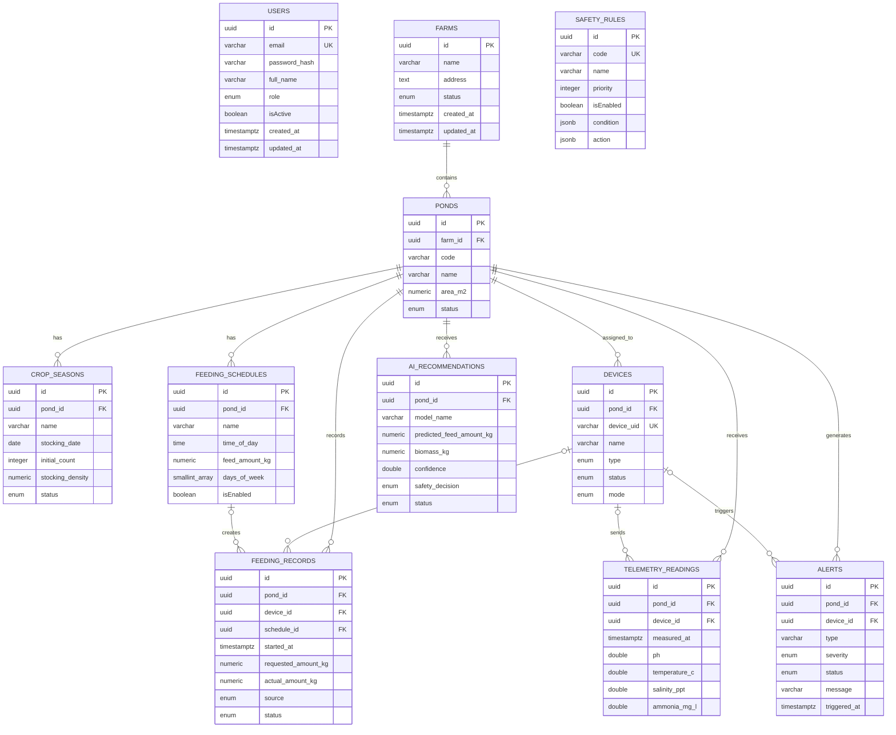

# ShrimpMate Database Schema

Tài liệu mô tả database hiện tại dựa trên các entity và migration của backend.

## 1. Danh sách bảng

- `users`
- `farms`
- `ponds`
- `crop_seasons`
- `devices`
- `feeding_schedules`
- `feeding_records`
- `telemetry_readings`
- `ai_recommendations`
- `safety_rules`
- `alerts`

## 2. Chi tiết bảng

### `users`

Lưu tài khoản đăng nhập.

| Cột | Kiểu | Ràng buộc / Mô tả |
|---|---|---|
| `id` | UUID | PK |
| `email` | VARCHAR(255) | Unique, bắt buộc |
| `password_hash` | VARCHAR(255) | Mật khẩu đã mã hóa |
| `full_name` | VARCHAR(150) | Bắt buộc |
| `role` | ENUM | `admin`, `manager`, `operator` |
| `isActive` | BOOLEAN | Mặc định `true` |
| `created_at` | TIMESTAMPTZ | Thời gian tạo |
| `updated_at` | TIMESTAMPTZ | Thời gian cập nhật |

Hiện tại `users` chưa có khóa ngoại đến bảng nghiệp vụ.

### `farms`

Lưu thông tin trang trại.

| Cột | Kiểu | Ràng buộc / Mô tả |
|---|---|---|
| `id` | UUID | PK |
| `name` | VARCHAR(150) | Bắt buộc |
| `address` | TEXT | Có thể rỗng |
| `status` | ENUM | `active`, `inactive` |
| `created_at` | TIMESTAMPTZ | Thời gian tạo |
| `updated_at` | TIMESTAMPTZ | Thời gian cập nhật |
| `deleted_at` | TIMESTAMPTZ | Có thể rỗng, dùng cho soft delete |

### `ponds`

Lưu thông tin ao nuôi.

| Cột | Kiểu | Ràng buộc / Mô tả |
|---|---|---|
| `id` | UUID | PK |
| `farm_id` | UUID | FK -> `farms.id`, bắt buộc |
| `code` | VARCHAR(50) | Mã ao |
| `name` | VARCHAR(150) | Tên ao |
| `area_m2` | NUMERIC(12,2) | Diện tích |
| `status` | ENUM | `active`, `inactive`, `maintenance` |
| `deleted_at` | TIMESTAMPTZ | Có thể rỗng, dùng cho soft delete |

### `crop_seasons`

Lưu các vụ nuôi của ao.

| Cột | Kiểu | Ràng buộc / Mô tả |
|---|---|---|
| `id` | UUID | PK |
| `pond_id` | UUID | FK -> `ponds.id`, bắt buộc |
| `name` | VARCHAR(150) | Tên vụ nuôi |
| `stocking_date` | DATE | Ngày thả giống |
| `initial_count` | INTEGER | Số lượng ban đầu |
| `stocking_density` | NUMERIC(12,2) | Mật độ thả |
| `initial_average_weight_g` | NUMERIC(8,3) | Có thể rỗng |
| `estimated_survival_rate` | NUMERIC(5,2) | Có thể rỗng |
| `status` | ENUM | `planned`, `active`, `completed`, `cancelled` |

Có unique partial index trên `pond_id` với điều kiện `status = 'active'`, bảo đảm mỗi Pond chỉ có một Crop Season đang hoạt động ngay cả khi có request đồng thời.

Các bảng nghiệp vụ có `created_at` và `updated_at` để audit. Các bảng ghi nhận sự kiện bất biến dùng timestamp nghiệp vụ riêng như `measured_at`, `triggered_at` hoặc `started_at`; Telemetry đã có index theo Pond/Device và thời gian.

### `devices`

Lưu các thiết bị IoT như feeder, sensor và camera.

| Cột | Kiểu | Ràng buộc / Mô tả |
|---|---|---|
| `id` | UUID | PK |
| `pond_id` | UUID | FK -> `ponds.id`, có thể rỗng |
| `device_uid` | VARCHAR(100) | Unique |
| `name` | VARCHAR(150) | Tên thiết bị |
| `type` | ENUM | `feeder`, `sensor_node`, `camera`, `edge_gateway` |
| `status` | ENUM | `online`, `offline`, `error`, `maintenance` |
| `mode` | ENUM | `automatic`, `manual`, `emergency_stop` |
| `firmware_version` | VARCHAR(50) | Có thể rỗng |
| `last_seen_at` | TIMESTAMPTZ | Có thể rỗng |
| `metadata` | JSONB | Mặc định `{}` |
| `created_at` | TIMESTAMPTZ | Thời gian tạo |
| `updated_at` | TIMESTAMPTZ | Thời gian cập nhật |

### `feeding_schedules`

Lưu lịch cho ăn tự động.

| Cột | Kiểu | Ràng buộc / Mô tả |
|---|---|---|
| `id` | UUID | PK |
| `pond_id` | UUID | FK -> `ponds.id`, bắt buộc |
| `name` | VARCHAR(150) | Tên lịch |
| `time_of_day` | TIME | Giờ cho ăn |
| `feed_amount_kg` | NUMERIC(10,3) | Khối lượng thức ăn |
| `spread_rate_kg_per_minute` | NUMERIC(10,3) | Có thể rỗng |
| `days_of_week` | SMALLINT ARRAY | Các ngày trong tuần |
| `isEnabled` | BOOLEAN | Mặc định `true` |
| `updated_at` | TIMESTAMPTZ | Thời gian cập nhật |

### `feeding_records`

Lưu lịch sử các lần cho ăn.

| Cột | Kiểu | Ràng buộc / Mô tả |
|---|---|---|
| `id` | UUID | PK |
| `pond_id` | UUID | FK -> `ponds.id`, bắt buộc |
| `device_id` | UUID | FK -> `devices.id`, có thể rỗng |
| `schedule_id` | UUID | FK -> `feeding_schedules.id`, có thể rỗng |
| `started_at` | TIMESTAMPTZ | Thời điểm bắt đầu |
| `finished_at` | TIMESTAMPTZ | Có thể rỗng |
| `requested_amount_kg` | NUMERIC(10,3) | Khối lượng yêu cầu |
| `actual_amount_kg` | NUMERIC(10,3) | Khối lượng thực tế, có thể rỗng |
| `source` | ENUM | `schedule`, `manual`, `ai` |
| `status` | ENUM | `requested`, `running`, `completed`, `stopped`, `failed` |
| `appetite_level` | SMALLINT | `0` none, `1` weak, `2` normal, `3` strong |
| `leftover_percent` | NUMERIC(5,2) | Có thể rỗng |
| `stopped_reason` | TEXT | Có thể rỗng |

### `telemetry_readings`

Lưu dữ liệu đo từ cảm biến môi trường.

| Cột | Kiểu | Ràng buộc / Mô tả |
|---|---|---|
| `id` | UUID | PK |
| `pond_id` | UUID | FK -> `ponds.id`, bắt buộc |
| `device_id` | UUID | FK -> `devices.id`, có thể rỗng |
| `measured_at` | TIMESTAMPTZ | Thời điểm đo |
| `ph` | DOUBLE PRECISION | Có thể rỗng |
| `dissolved_oxygen_mg_l` | DOUBLE PRECISION | Có thể rỗng |
| `temperature_c` | DOUBLE PRECISION | Có thể rỗng |
| `salinity_ppt` | DOUBLE PRECISION | Có thể rỗng |
| `ammonia_mg_l` | DOUBLE PRECISION | Có thể rỗng |
| `turbidity_ntu` | DOUBLE PRECISION | Có thể rỗng |
| `rawData` | JSONB | Mặc định `{}` |

Index hiện có: `(pond_id, measured_at)` và `(device_id, measured_at)`.

### `ai_recommendations`

Lưu các đề xuất do AI tạo ra.

| Cột | Kiểu | Ràng buộc / Mô tả |
|---|---|---|
| `id` | UUID | PK |
| `pond_id` | UUID | FK -> `ponds.id`, bắt buộc |
| `model_name` | VARCHAR(100) | Tên model |
| `model_version` | VARCHAR(50) | Có thể rỗng |
| `predicted_feed_amount_kg` | NUMERIC(10,3) | Có thể rỗng |
| `spread_rate_kg_per_minute` | NUMERIC(10,3) | Có thể rỗng |
| `appetite_level` | SMALLINT | Có thể rỗng |
| `biomass_kg` | NUMERIC(12,3) | Có thể rỗng |
| `anomaly_score` | DOUBLE PRECISION | Có thể rỗng |
| `confidence` | DOUBLE PRECISION | Có thể rỗng |
| `input_snapshot` | JSONB | Dữ liệu đầu vào |
| `explanation` | TEXT | Có thể rỗng |
| `safety_decision` | ENUM | `allowed`, `adjusted`, `blocked`; có thể rỗng |
| `safety_reason` | TEXT | Có thể rỗng |
| `status` | ENUM | `pending`, `approved`, `rejected`, `executed` |
| `created_at` | TIMESTAMPTZ | Thời gian tạo |

### `safety_rules`

Lưu các luật kiểm tra an toàn.

| Cột | Kiểu | Ràng buộc / Mô tả |
|---|---|---|
| `id` | UUID | PK |
| `code` | VARCHAR(100) | Unique |
| `name` | VARCHAR(150) | Tên luật |
| `priority` | INTEGER | Mặc định `100` |
| `isEnabled` | BOOLEAN | Mặc định `true` |
| `condition` | JSONB | Điều kiện |
| `action` | JSONB | Hành động |
| `created_at` | TIMESTAMPTZ | Thời gian tạo |
| `updated_at` | TIMESTAMPTZ | Thời gian cập nhật |

Bảng này hiện chưa có quan hệ khóa ngoại với bảng khác.

### `alerts`

Lưu các cảnh báo từ ao hoặc thiết bị.

| Cột | Kiểu | Ràng buộc / Mô tả |
|---|---|---|
| `id` | UUID | PK |
| `pond_id` | UUID | FK -> `ponds.id`, bắt buộc |
| `device_id` | UUID | FK -> `devices.id`, có thể rỗng |
| `type` | VARCHAR(100) | Loại cảnh báo |
| `severity` | ENUM | `1` monitoring, `2` warning, `3` critical |
| `status` | ENUM | `open`, `acknowledged`, `resolved` |
| `message` | VARCHAR(255) | Nội dung cảnh báo |
| `triggered_at` | TIMESTAMPTZ | Thời điểm phát sinh |
| `acknowledged_at` | TIMESTAMPTZ | Có thể rỗng |
| `resolved_at` | TIMESTAMPTZ | Có thể rỗng |
| `metadata` | JSONB | Mặc định `{}` |
| `created_at` | TIMESTAMPTZ | Thời gian tạo |
| `updated_at` | TIMESTAMPTZ | Thời gian cập nhật |

## 3. Quan hệ giữa các bảng

| Quan hệ | Cardinality | On delete |
|---|---:|---|
| `farms` -> `ponds` | 1 - N | Xóa farm sẽ xóa ponds |
| `ponds` -> `crop_seasons` | 1 - N | Xóa pond sẽ xóa crop seasons |
| `ponds` -> `devices` | 1 - N | Xóa pond sẽ set `devices.pond_id = NULL` |
| `ponds` -> `feeding_schedules` | 1 - N | Xóa pond sẽ xóa schedules |
| `ponds` -> `feeding_records` | 1 - N | Xóa pond sẽ xóa records |
| `ponds` -> `telemetry_readings` | 1 - N | Xóa pond sẽ xóa readings |
| `ponds` -> `ai_recommendations` | 1 - N | Xóa pond sẽ xóa recommendations |
| `ponds` -> `alerts` | 1 - N | Xóa pond sẽ xóa alerts |
| `devices` -> `feeding_records` | 1 - N, tùy chọn | Xóa device sẽ set FK thành `NULL` |
| `devices` -> `telemetry_readings` | 1 - N, tùy chọn | Xóa device sẽ set FK thành `NULL` |
| `devices` -> `alerts` | 1 - N, tùy chọn | Xóa device sẽ set FK thành `NULL` |
| `feeding_schedules` -> `feeding_records` | 1 - N, tùy chọn | Xóa schedule sẽ set FK thành `NULL` |

## 4. ERD Mermaid

## 5. Lưu ý khi vẽ ERD

- Tất cả bảng đều dùng UUID làm khóa chính.
- `PK` là khóa chính, `FK` là khóa ngoại và `UK` là unique key.
- `device_id` và `schedule_id` trong các bảng nghiệp vụ là khóa ngoại tùy chọn.
- `pond_id` của `devices` là tùy chọn vì thiết bị có thể tồn tại trước khi được gán vào ao.
- `users` và `safety_rules` hiện là các bảng độc lập.
- Một số tên cột dùng camel case là `isActive` và `rawData`; các cột còn lại chủ yếu dùng snake case.