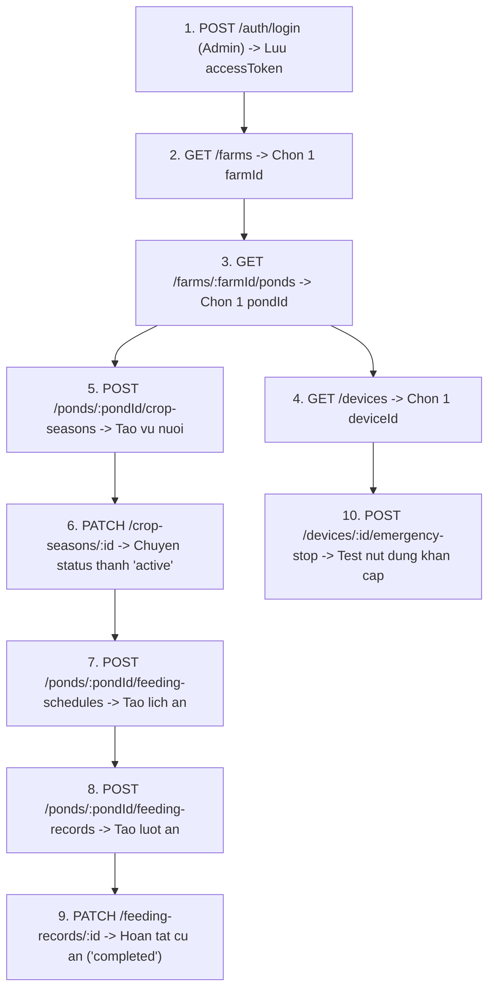

# ShrimpMate - Bo Mau Test Postman Cho Tat Ca API

Tai lieu nay cung cap day du cac mau request (Method, URL, Headers, JSON Body, Role quy dinh) de test toan bo API cua backend qua **Postman**.

---

## 1. Huong Dan Thiet Lap Postman Nhanh

### 1.1. Tao Environment trong Postman

Tao mot **Environment** moi (dat ten la `ShrimpMate Local`) voi cac bien sau:

| Variable Name | Initial Value | Ghi chu |
| --- | --- | --- |
| `baseUrl` | `http://localhost:3000` | Doi sang `http://192.168.24.35:3000` khi test khac may |
| `accessToken` | *(de trong)* | Tu dong luu sau khi dang nhap |
| `refreshToken` | *(de trong)* | Tu dong luu sau khi dang nhap |
| `farmId` | *(de trong)* | Luu ID lay tu API Farm |
| `pondId` | *(de trong)* | Luu ID lay tu API Pond |
| `deviceId` | *(de trong)* | Luu ID lay tu API Device |
| `cropSeasonId` | *(de trong)* | Luu ID lay tu API Crop Season |
| `feedingScheduleId` | *(de trong)* | Luu ID lay tu API Schedule |
| `feedingRecordId` | *(de trong)* | Luu ID lay tu API Record |

### 1.2. Tu dong luu `accessToken` sau khi dang nhap (Postman Test Script)

Trong Postman, tai request **POST Login**, vao tab **Tests** va dan doan script nay vao:

```javascript
if (pm.response.code === 200) {
    const res = pm.response.json();
    if (res.accessToken) {
        pm.environment.set("accessToken", res.accessToken);
        console.log("Da cap nhat accessToken moi!");
    }
    if (res.refreshToken) {
        pm.environment.set("refreshToken", res.refreshToken);
        console.log("Da cap nhat refreshToken moi!");
    }
}
```

Moi lan ban bam Send o request Login, Postman se tu dong luu token vao bien `{{accessToken}}` ma khong can copy tay!

### 1.3. Cau hinh Authorization o Collection hoac Folder

- Tab **Authorization**: Chon Type **Bearer Token**
- Token: `{{accessToken}}`

---

## 2. Tai Khoan Mau Co San (Seed Accounts)

He thong da co san 3 tai khoan voi 3 phan quyen khac nhau:

| Role | Email | So dien thoai | Mat khau |
| --- | --- | --- | --- |
| `admin` | `admin@shrimpmate.local` | `0901000001` | `Admin@123456` |
| `manager` | `manager@shrimpmate.local` | `0901000002` | `Manager@123456` |
| `operator` | `operator@shrimpmate.local` | `0901000003` | `Operator@123456` |

---

## 3. Health Check

### [GET] Kiem tra server hoat dong
- **URL**: `{{baseUrl}}/`
- **Method**: `GET`
- **Auth**: Khong can
- **Expected Response**: `200 OK` (`Hello World!`)

---

## 4. Module Authentication & User (`/auth`)

### 4.1. [POST] Dang ky tai khoan moi (Mac dinh role `operator`)
- **URL**: `{{baseUrl}}/auth/register`
- **Method**: `POST`
- **Auth**: Khong can
- **Body (raw JSON)**:
```json
{
  "email": "nhanvien01@example.com",
  "phoneNumber": "0912345678",
  "password": "Password@123",
  "fullName": "Nguyen Van A"
}
```

### 4.2. [POST] Dang nhap (Lay Access Token & Refresh Token)
- **URL**: `{{baseUrl}}/auth/login`
- **Method**: `POST`
- **Auth**: Khong can
- **Body 1: Dang nhap bang Email (Admin)**:
```json
{
  "identifier": "admin@shrimpmate.local",
  "password": "Admin@123456"
}
```
- **Body 2: Dang nhap bang So dien thoai (Manager)**:
```json
{
  "identifier": "0901000002",
  "password": "Manager@123456"
}
```

### 4.3. [POST] Lam moi Token (Refresh Token)
- **URL**: `{{baseUrl}}/auth/refresh-token`
- **Method**: `POST`
- **Auth**: Khong can
- **Body (raw JSON)**:
```json
{
  "refreshToken": "{{refreshToken}}"
}
```

### 4.4. [POST] Quen mat khau (Yeu cau ma OTP)
- **URL**: `{{baseUrl}}/auth/forgot-password`
- **Method**: `POST`
- **Auth**: Khong can
- **Body 1: Yeu cau bang Email**:
```json
{
  "identifier": "admin@shrimpmate.local"
}
```
- **Body 2: Yeu cau bang So dien thoai**:
```json
{
  "identifier": "0901000001"
}
```
*(Luu y: Trong moi truong dev, ma OTP 6 so se duoc in thang ra terminal console cua server Backend)*

### 4.5. [POST] Dat lai mat khau bang ma OTP
- **URL**: `{{baseUrl}}/auth/reset-password`
- **Method**: `POST`
- **Auth**: Khong can
- **Body (raw JSON)**:
```json
{
  "identifier": "admin@shrimpmate.local",
  "otp": "123456",
  "newPassword": "NewPassword@123"
}
```

### 4.6. [GET] Lay thong tin user hien tai
- **URL**: `{{baseUrl}}/auth/me`
- **Method**: `GET`
- **Auth**: Bearer Token (`{{accessToken}}`)
- **Role**: `admin`, `manager`, `operator`

### 4.7. [PATCH] Doi mat khau (User da dang nhap)
- **URL**: `{{baseUrl}}/auth/change-password`
- **Method**: `PATCH`
- **Auth**: Bearer Token (`{{accessToken}}`)
- **Body (raw JSON)**:
```json
{
  "currentPassword": "Admin@123456",
  "newPassword": "Admin@NewPass123"
}
```

### 4.8. [GET] Kiem tra quyen Admin
- **URL**: `{{baseUrl}}/auth/admin-check`
- **Method**: `GET`
- **Auth**: Bearer Token (`{{accessToken}}`)
- **Role**: `admin` (Neu dang nhap role khac se tra ve `403 Forbidden`)

### 4.9. [GET] Admin lay danh sach tat ca tai khoan
- **URL**: `{{baseUrl}}/auth/users`
- **Method**: `GET`
- **Auth**: Bearer Token (`{{accessToken}}`)
- **Role**: `admin`

### 4.10. [POST] Admin tao tai khoan chi dinh Role
- **URL**: `{{baseUrl}}/auth/users`
- **Method**: `POST`
- **Auth**: Bearer Token (`{{accessToken}}`)
- **Role**: `admin`
- **Body (raw JSON)**:
```json
{
  "email": "manager_new@shrimpmate.local",
  "phoneNumber": "0908888999",
  "password": "Manager@123456",
  "fullName": "Tran Quan Ly",
  "role": "manager"
}
```

### 4.11. [PATCH] Admin thay doi Role cua User
- **URL**: `{{baseUrl}}/auth/users/{{userId}}/role`
- **Method**: `PATCH`
- **Auth**: Bearer Token (`{{accessToken}}`)
- **Role**: `admin`
- **Body (raw JSON)**:
```json
{
  "role": "manager"
}
```
*(Gia tri hop le: `admin`, `manager`, `operator`)*

### 4.12. [PATCH] Admin khoa hoac mo khoa tai khoan
- **URL**: `{{baseUrl}}/auth/users/{{userId}}/status`
- **Method**: `PATCH`
- **Auth**: Bearer Token (`{{accessToken}}`)
- **Role**: `admin`
- **Body (raw JSON)**:
```json
{
  "isActive": false
}
```

### 4.13. [POST] Admin gan User vao Ao (Pond Assignment)
- **URL**: `{{baseUrl}}/auth/users/{{userId}}/ponds`
- **Method**: `POST`
- **Auth**: Bearer Token (`{{accessToken}}`)
- **Role**: `admin`
- **Body (raw JSON)**:
```json
{
  "pondId": "{{pondId}}"
}
```

### 4.14. [DELETE] Admin go User khoi Ao
- **URL**: `{{baseUrl}}/auth/users/{{userId}}/ponds/{{pondId}}`
- **Method**: `DELETE`
- **Auth**: Bearer Token (`{{accessToken}}`)
- **Role**: `admin`

---

## 5. Module Farm (Trang trai) (`/farms`)

### 5.1. [GET] Lay danh sach trang trai (Co phan trang)
- **URL**: `{{baseUrl}}/farms?page=1&limit=10`
- **Method**: `GET`
- **Auth**: Bearer Token (`{{accessToken}}`)
- **Role**: `admin`, `manager`, `operator`

### 5.2. [POST] Tao trang trai moi
- **URL**: `{{baseUrl}}/farms`
- **Method**: `POST`
- **Auth**: Bearer Token (`{{accessToken}}`)
- **Role**: `admin`
- **Body (raw JSON)**:
```json
{
  "name": "Trang trai Tom Sóng Vàng",
  "address": "Dong Hai, Bac Lieu, Viet Nam",
  "status": "active"
}
```
*(Gia tri status: `active`, `inactive`)*

### 5.3. [GET] Lay chi tiet trang trai theo ID
- **URL**: `{{baseUrl}}/farms/{{farmId}}`
- **Method**: `GET`
- **Auth**: Bearer Token (`{{accessToken}}`)
- **Role**: `admin`, `manager`, `operator`

### 5.4. [PATCH] Cap nhat thong tin trang trai
- **URL**: `{{baseUrl}}/farms/{{farmId}}`
- **Method**: `PATCH`
- **Auth**: Bearer Token (`{{accessToken}}`)
- **Role**: `admin`, `manager`
- **Body (raw JSON)**:
```json
{
  "name": "Trang trai Tom Sóng Vàng - Khu A",
  "status": "active"
}
```

### 5.5. [DELETE] Xoa trang trai (Soft Delete)
- **URL**: `{{baseUrl}}/farms/{{farmId}}`
- **Method**: `DELETE`
- **Auth**: Bearer Token (`{{accessToken}}`)
- **Role**: `admin`

---

## 6. Module Pond (Ao nuoi) (`/farms/:farmId/ponds`)

### 6.1. [GET] Lay danh sach ao cua trang trai
- **URL**: `{{baseUrl}}/farms/{{farmId}}/ponds?page=1&limit=20`
- **Method**: `GET`
- **Auth**: Bearer Token (`{{accessToken}}`)
- **Role**: `admin`, `manager`, `operator`

### 6.2. [POST] Tao ao nuoi moi trong trang trai
- **URL**: `{{baseUrl}}/farms/{{farmId}}/ponds`
- **Method**: `POST`
- **Auth**: Bearer Token (`{{accessToken}}`)
- **Role**: `admin`
- **Body (raw JSON)**:
```json
{
  "code": "POND-05",
  "name": "Ao So 5 - Uom giong",
  "areaM2": 2500,
  "status": "active"
}
```
*(Gia tri status: `active`, `inactive`, `maintenance`)*

### 6.3. [GET] Lay chi tiet ao nuoi
- **URL**: `{{baseUrl}}/farms/{{farmId}}/ponds/{{pondId}}`
- **Method**: `GET`
- **Auth**: Bearer Token (`{{accessToken}}`)
- **Role**: `admin`, `manager`, `operator`

### 6.4. [PATCH] Cap nhat thong tin ao nuoi
- **URL**: `{{baseUrl}}/farms/{{farmId}}/ponds/{{pondId}}`
- **Method**: `PATCH`
- **Auth**: Bearer Token (`{{accessToken}}`)
- **Role**: `admin`, `manager`
- **Body (raw JSON)**:
```json
{
  "name": "Ao So 5 - Uom giong dot 1",
  "areaM2": 2600,
  "status": "active"
}
```

### 6.5. [DELETE] Xoa ao nuoi
- **URL**: `{{baseUrl}}/farms/{{farmId}}/ponds/{{pondId}}`
- **Method**: `DELETE`
- **Auth**: Bearer Token (`{{accessToken}}`)
- **Role**: `admin`

---

## 7. Module Device (Thiet bi IoT) (`/devices`)

### 7.1. [GET] Lay danh sach thiet bi
- **URL**: `{{baseUrl}}/devices`
- **Method**: `GET`
- **Auth**: Bearer Token (`{{accessToken}}`)
- **Role**: `admin`, `manager`, `operator`

### 7.2. [POST] Dang ky / Tao thiet bi moi
- **URL**: `{{baseUrl}}/devices`
- **Method**: `POST`
- **Auth**: Bearer Token (`{{accessToken}}`)
- **Role**: `admin`, `manager`
- **Body 1: May cho an (Feeder)**:
```json
{
  "deviceUid": "DEV-FEEDER-2026-01",
  "name": "Máy cho ăn tự động Ao 1",
  "type": "feeder",
  "status": "online",
  "mode": "automatic",
  "pondId": "{{pondId}}",
  "firmwareVersion": "1.2.0",
  "metadata": {
    "zone": "khu-bac",
    "feederCapacityKg": 50,
    "batteryPercent": 95
  }
}
```
- **Body 2: Tram cam bien moi truong (Sensor Node)**:
```json
{
  "deviceUid": "DEV-SENSOR-DO-001",
  "name": "Trạm cảm biến Oxy & pH Ao 1",
  "type": "sensor_node",
  "status": "online",
  "mode": "automatic",
  "pondId": "{{pondId}}",
  "firmwareVersion": "2.0.1",
  "metadata": {
    "sensorTypes": ["do", "ph", "temperature", "salinity"]
  }
}
```
*(Gia tri type: `feeder`, `sensor_node`, `camera`, `edge_gateway`)*  
*(Gia tri status: `online`, `offline`, `error`, `maintenance`)*  
*(Gia tri mode: `automatic`, `manual`, `emergency_stop`)*

### 7.3. [GET] Lay chi tiet thiet bi
- **URL**: `{{baseUrl}}/devices/{{deviceId}}`
- **Method**: `GET`
- **Auth**: Bearer Token (`{{accessToken}}`)
- **Role**: `admin`, `manager`, `operator`

### 7.4. [PATCH] Cap nhat thong tin thiet bi
- **URL**: `{{baseUrl}}/devices/{{deviceId}}`
- **Method**: `PATCH`
- **Auth**: Bearer Token (`{{accessToken}}`)
- **Role**: `admin`, `manager`
- **Body (raw JSON)**:
```json
{
  "status": "online",
  "mode": "automatic",
  "firmwareVersion": "1.2.1"
}
```

### 7.5. [POST] Dung khan cap thiet bi (Emergency Stop)
- **URL**: `{{baseUrl}}/devices/{{deviceId}}/emergency-stop`
- **Method**: `POST`
- **Auth**: Bearer Token (`{{accessToken}}`)
- **Role**: `admin`, `manager`, `operator` (Dung de dung gap khi thiet bi gap su co)

### 7.6. [POST] Cap nhat Heartbeat cho thiet bi (REST test)
- **URL**: `{{baseUrl}}/devices/{{deviceId}}/heartbeat`
- **Method**: `POST`
- **Auth**: Bearer Token (`{{accessToken}}`)
- **Role**: `admin`, `manager`

### 7.7. [DELETE] Xoa thiet bi
- **URL**: `{{baseUrl}}/devices/{{deviceId}}`
- **Method**: `DELETE`
- **Auth**: Bearer Token (`{{accessToken}}`)
- **Role**: `admin`

---

## 8. Module Crop Season (Vu nuoi)

### 8.1. [GET] Lay danh sach vu nuoi cua ao
- **URL**: `{{baseUrl}}/ponds/{{pondId}}/crop-seasons`
- **Method**: `GET`
- **Auth**: Bearer Token (`{{accessToken}}`)
- **Role**: `admin`, `manager`, `operator`

### 8.2. [POST] Tao vu nuoi moi cho ao
- **URL**: `{{baseUrl}}/ponds/{{pondId}}/crop-seasons`
- **Method**: `POST`
- **Auth**: Bearer Token (`{{accessToken}}`)
- **Role**: `admin`, `manager`
- **Body (raw JSON)**:
```json
{
  "name": "Vụ Tôm Thẻ Chân Trắng - Mùa Mưa 2026",
  "stockingDate": "2026-09-20",
  "initialCount": 250000,
  "stockingDensity": 80.5,
  "initialAverageWeightG": 0.02,
  "estimatedSurvivalRate": 88.5,
  "status": "planned"
}
```
*(Gia tri status: `planned`, `active`, `completed`, `cancelled`)*  
*(Luu y: Moi ao chi duoc phep co toi da 1 vu o trang thai `active` tai mot thoi diem)*

### 8.3. [GET] Lay chi tiet vu nuoi
- **URL**: `{{baseUrl}}/crop-seasons/{{cropSeasonId}}`
- **Method**: `GET`
- **Auth**: Bearer Token (`{{accessToken}}`)
- **Role**: `admin`, `manager`, `operator`

### 8.4. [PATCH] Cap nhat thong tin / trang thai vu nuoi
- **URL**: `{{baseUrl}}/crop-seasons/{{cropSeasonId}}`
- **Method**: `PATCH`
- **Auth**: Bearer Token (`{{accessToken}}`)
- **Role**: `admin`, `manager`
- **Body 1: Kich hoat vu nuoi thanh `active`**:
```json
{
  "status": "active"
}
```
- **Body 2: Ket thuc vu nuoi thanh `completed`**:
```json
{
  "status": "completed"
}
```

### 8.5. [DELETE] Xoa vu nuoi
- **URL**: `{{baseUrl}}/crop-seasons/{{cropSeasonId}}`
- **Method**: `DELETE`
- **Auth**: Bearer Token (`{{accessToken}}`)
- **Role**: `admin`

---

## 9. Module Feeding (Cho an & Lich trinh)

### 9.1. [GET] Lay danh sach lich cho an cua ao
- **URL**: `{{baseUrl}}/ponds/{{pondId}}/feeding-schedules`
- **Method**: `GET`
- **Auth**: Bearer Token (`{{accessToken}}`)
- **Role**: `admin`, `manager`, `operator`

### 9.2. [POST] Tao lich cho an moi
- **URL**: `{{baseUrl}}/ponds/{{pondId}}/feeding-schedules`
- **Method**: `POST`
- **Auth**: Bearer Token (`{{accessToken}}`)
- **Role**: `admin`, `manager`
- **Body (raw JSON)**:
```json
{
  "name": "Cữ cho ăn sáng",
  "timeOfDay": "07:30",
  "feedAmountKg": 15.5,
  "spreadRateKgPerMinute": 1.5,
  "daysOfWeek": [1, 2, 3, 4, 5, 6, 0],
  "isEnabled": true
}
```
*(Chu thich: `daysOfWeek`: mang chua cac ngay trong tuan tu `0` den `6`, voi `0` la Chu Nhat)*

### 9.3. [PATCH] Cap nhat lich cho an
- **URL**: `{{baseUrl}}/feeding-schedules/{{feedingScheduleId}}`
- **Method**: `PATCH`
- **Auth**: Bearer Token (`{{accessToken}}`)
- **Role**: `admin`, `manager`
- **Body (raw JSON)**:
```json
{
  "feedAmountKg": 18.0,
  "isEnabled": true
}
```

### 9.4. [DELETE] Xoa lich cho an
- **URL**: `{{baseUrl}}/feeding-schedules/{{feedingScheduleId}}`
- **Method**: `DELETE`
- **Auth**: Bearer Token (`{{accessToken}}`)
- **Role**: `admin`

### 9.5. [GET] Lay lich su nhat ky cho an cua ao
- **URL**: `{{baseUrl}}/ponds/{{pondId}}/feeding-records`
- **Method**: `GET`
- **Auth**: Bearer Token (`{{accessToken}}`)
- **Role**: `admin`, `manager`, `operator`

### 9.6. [POST] Tao nhat ky cho an moi (Feeding Record)
- **URL**: `{{baseUrl}}/ponds/{{pondId}}/feeding-records`
- **Method**: `POST`
- **Auth**: Bearer Token (`{{accessToken}}`)
- **Role**: `admin`, `manager`
- **Body (raw JSON)**:
```json
{
  "deviceId": "{{deviceId}}",
  "scheduleId": "{{feedingScheduleId}}",
  "requestedAmountKg": 15.5,
  "actualAmountKg": 15.2,
  "source": "schedule",
  "status": "requested"
}
```
*(Gia tri source: `schedule`, `manual`, `ai`)*  
*(Gia tri status: `requested`, `running`, `completed`, `stopped`, `failed`)*  
*(Luu y: Ao phai dang co 1 vu nuoi o trang thai `active` thi moi tao duoc feeding record)*

### 9.7. [PATCH] Cap nhat ket qua lan cho an (Thuc an thuc te / Thuc an thua)
- **URL**: `{{baseUrl}}/feeding-records/{{feedingRecordId}}`
- **Method**: `PATCH`
- **Auth**: Bearer Token (`{{accessToken}}`)
- **Role**: `admin`, `manager`
- **Body (raw JSON)**:
```json
{
  "status": "completed",
  "actualAmountKg": 15.2,
  "appetiteLevel": 2,
  "leftoverPercent": 2.5
}
```
*(Gia tri appetiteLevel: `1` (it an / yeu), `2` (binh thuong), `3` (an manh))*

---

## 10. Luong Test Chuan (Recommended Testing Flow)

De test toan dien tat ca cac module tu dau den cuoi, ban nen thuc hien theo trinh tu sau:


